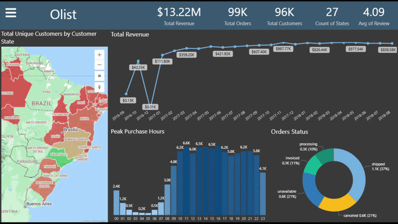

# 📊 Olist E-Commerce: End-to-End Strategic Analysis
### Analytics Engineering (SQL) & Advanced Visualization (Power BI)

---

## 📺 Dashboard Preview

---

## 🔗 Project Access
* **[📥 Download Full .PBIX File (via Google Drive)](https://drive.google.com/file/d/1jkYWEAigoG8AcR6jo1AxUshDb4pW3Jgk/view?usp=sharing)**
* **[📜 Explore SQL Queries](SQL/)**
* **[📄 View Full Report (PDF Export)](media/Olist_Analysis_Report.pdf)**

---

## 🚀 The Business Challenge
As part of this project, I analyzed the **Olist Dataset** (100k+ orders from Brazil) to solve real-world retail problems. I focused on identifying high-cost logistics regions and understanding customer retention patterns.

### 💡 Key Strategic Insights:
* **Logistics Bottleneck:** Pinpointed specific categories (e.g., "Home Comfort") where freight expenses account for up to **92%** of the transaction value, signaling a critical need for regional distribution centers.
* **The Retention Gap:** Data reveals that **94.2%** of revenue is generated by one-time buyers, highlighting a significant untapped opportunity for CRM and loyalty strategies.
* **Satisfaction Drivers:** Statistically proved that "Top-Rated" reviews (4.5+) are most frequent when deliveries arrive **12-20 days ahead** of the estimated schedule.

---

## 🛠️ Technical Execution

### 1️⃣ Analytics Engineering & Data Validation (SQL)
* **Extraction & Cleaning:** Used complex Joins and CTEs to prepare the raw relational data.
* **Data Validation:** Performed extensive **Verification and Testing** using SQL queries to ensure data integrity, identify outliers, and cross-check KPIs against the raw source before visualization.
* **Check out the `SQL_Queries` folder for the full scripts.**

### 2️⃣ Advanced Visualization (Power BI)
* **Data Modeling:** Built a robust **Star Schema** to handle 8+ interconnected tables.
* **UX/UI Design:** Created a custom **Dark Mode** dashboard with a functional **Hamburger Menu** for seamless navigation.
* **Advanced DAX:** Developed dynamic measures for Time Intelligence, Cohort Analysis, and Cross-filtering.

---

## 📂 Repository Structure
* `SQL/`: All SQL scripts used for data extraction and cleaning.
* `media/`: GIF demo and visual assets.

---

## 👤 About Me
**Adi | Data Analyst**

This project is a result of my **self-driven journey to master Power BI**, where I successfully translated complex business intelligence principles into a professional-grade analytical tool. 

I am a versatile Data Professional with over **2.5 years of experience in Qlik Sense**, specializing in high-impact solutions using **SQL, Power BI, and Qlik Sense**.

📫 **Let's Connect:** [https://www.linkedin.com/in/adi-sandler-61ab4639a/] | [adi.sandler324@gmail.com]
